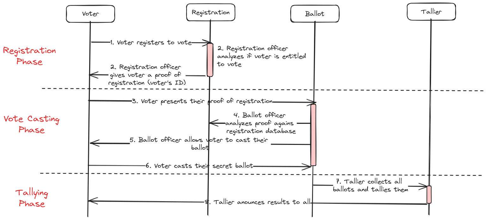
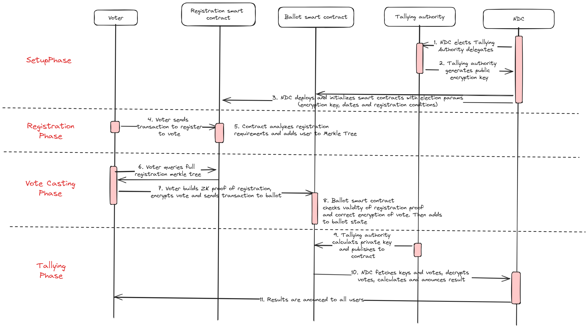

# NDC Private Voting Architecture

This document describes the proposed architecture to build a private and decentralized voting system for the Near Digital Collective (NDC).

It is divided in the following sections:
1. [Requirements](#requirements)
2. [Components](#components)
3. [Architecture](#architecture)
3. [Implementation](#implementation)
4. [Future Developments](#future-developments)

## Requirements

NDC is spearheading efforts to decentralize governance in the Near ecosystem. The first electoral process was carried out in 2023 and elected the first term of representatives. In this process a lot was learnt and the election faced some interesting problems:

- Lack of privacy -> everyone could see who other people were voting for, which could cause retaliation amongst communities and candidates
- Partial results -> as the election was fully public, voters could see the current tally of each candidate, which alters their perception about who is going to win and might make them change votes
- Bribing -> voters could be payed or rewarded in different ways by showing that they voted for a specific candidate

Developing a new voting framework that ameliorates those issues is going to significantly contribute to the decentralization, legitimacy and fairness of the next elections. 

The solution for those problems is a voting system with the following features:
1. Anonymous voting -> Users can vote by proving their correct registration, but without revealing their identity in the vote transaction
2. Anonymous ballot -> Vote transactions do NOT reveal the content of the vote. They are encrypted on chain and only revealed at the end of the vote
3. Receipt obfuscation -> A user can verify that their vote was correctly counted in an election, but they cannot prove to other people who they voted for - this prevents bribing, vote buying and other collusion techniques

## Components

Privacy preserving elections are structured in 3 different sequential steps: (i) registration, (ii) vote casting and (iii) tallying. This is how national elections and other high profile voting processes are implemented around the world.
- In **registration** phase, eligible voters must perform some sort of registration procedure. Upon performing this procedure they are enlisted in the list of voters;
- In **vote casting** phase, only people that have registered can participate. Voters go to a voting poll, present some proof of their registration and cast a closed ballot that does not contain the identity of the voter and is kept secret until the end of the vote casting phase; 
- In **tallying** phase, the ballots are opened, the votes are counted and the result is announced.

We are going to implement a similar architecture where all processes are handled by smart contracts in the Near blockchain and privacy is ensured by cryptography and not by relying on electoral authorities.

## Architecture

The architecture requires us to use some cryptographic primitives:
- [Encryption keys (public and private keys)](https://www.preveil.com/blog/public-and-private-key/#:~:text=The%20public%20key%20is%20used,data%20passes%20through%20unsecured%20networks.)
- [Hash functions](https://www.mylawrd.com/what-is-hashing-for-dummies/)
- [Zero Knowledge Proofs](https://medium.com/veridise/zero-knowledge-for-dummies-introduction-to-zk-proofs-29e3fe9604f1#:~:text=The%20OG%20definition%20of%20a,this%20specific%20statement%20is%20true.)
- [Multi Party Computation](https://www.fireblocks.com/what-is-mpc/)
- [Secret sharing](https://medium.com/@keylesstech/a-beginners-guide-to-shamir-s-secret-sharing-e864efbf3648)
- [Time locked puzzles](https://dl.acm.org/doi/book/10.5555/888615)

Understanding of the primitives is assumed, for those unfamiliar please refer to the links above.

**The system is built as 3 separate components:**

### Registration smart contract
A smart contract in the Near Protocol that has a fixed time window during which voters can register. 
This smart contract is agnostic to registration requirements, the election can implement whichever requirements they'd like, for instance: (i) ownership of NFT/SBT, (ii) ownership of an amount of tokens, (iii) NFT proving KYC procedure, (iv) zero knowledge proof attesting to any sort of off chain information.
All registered voters are inserted in the contract's state as a Merkle Tree.
Once the time window is closed, no more voters can register.

### Ballot smart contract
A smart contract in the Near Protocol that has a fixed time window during which voters can cat their votes.
The smart contract is tightly coupled with the Registration smart contract adn with the Tallying Authority. To be able to cast a ballot users must prove that (i) they are registered in the Registration smart contract, (ii) they haven't voted yet (avoiding double votes) and (iii) they have correctly formatted and encrypted their vote using the Tallying Authority's public key.
All votes are verified and, if valid, their encrypted values are logged as events in the contract.

### Tallying authority
A cryptographic procedure (not a smart contract) that creates an encryption key pair (a public key and a private key).
The authorities goal is to generate a public encryption key that everyone has access to, so that they can encrypt their votes. At the same time, the private key should be available to no one, and only revealed as the voting period ends. With the private key anyone can decrypt all votes and calculate the result of the election.

There are multiple ways to create a Tallying Authority, it can simply be a centralized entity holding the keys or complex cryptographic schemes such as time based encryption. The first version of the protocol is going to implement a simple secret sharing algorithm. The appendix discusses proposals for further improvements of the Tallying Authority.

A secret sharing Tallying Authority works as a Multi Party Computation procedure:
1. A group of `N` delegates is selected
2. Each of the delegates creates a secret value
3. All delegates come together to create a pair of encryption keys. However, this keys can only be calculated by using the secret of at least `k` out of `N` delegates
4. Delegates create only the public key and publish it
5. Voting process is carried out
6. After voting ends, delegates come together and generate the private key and publish it on the blockchain
7. Now anyone can see the private key and use it to decrypt all historical votes and verify the election's results

### Application Flow

The 3 components interact together according to the following diagram:

**Setup Phase**

1. During setup, NDC must elect a council of delegates that are going to make up the Tallying Authority;
2. The elected delegates perform an MPC ceremony to generate the public encryption key;
3. NDC deploys and initializes all the smart contracts with the correct parameters: dates, requirements for registration and public encryption key;

**Registration Phase**

4. Voters send transactions to smart contract to register for voting;
5. Registration smart contract analyzes each account to check if they fulfill the requirements, then adds them to a merkle tree of registered voters;

**Vote Casting Phase**

6. Voters must query the full registration merkle tree in the Registration smart contract to get inputs for the Zero Knowledge Proof;
7. Voter builds their vote with the following pieces: (i) zero knowledge proof of registration, (ii) encrypted vote, (iii) zero knowledge proof that the encrypted vote is correctly formatted;
8. Ballot smart contract verifies proofs and if approved adds the vote to the contract's state as an event;

**Tallying Phase**

9. Tallying Authority delegates perform an MPC ceremony to generate the private encryption key and publish it to the ballot smart contract;
10. The NDC fetches the encryption key and uses it to decrypt all votes and tally the result. It then publishes the result;
11. Any user can independently verify the result by using the private key to decrypt all votes and perform the tally themselves.

### The relayer issue
Users become anonymous through the use of Zero Knowledge proofs, however, this anonymity is useless if they use their own account to pay for gas to send the vote transaction - anyone can easily assume that the account paying the gas is the voter. To avoid this problem, the use of relayers is necessary. A relayer is a server, holding a private key, anyone can send their transactions to it and it is going to sign them and pay for gas - in this way no one is going to give up their anonymity by through gas payments.

## Roadmap
| Milestone | Description | Estimated Time |
| --------- | ----------- | -------------- |
| 1. Registration smart contract | Build the smart contract for registration, it must be able to integrate into a different contract, written by the NDC that dictates the requirements for registration. It must also implement a merkle tree with a ZK-friendly hash function | 2 weeks |
| 2. Vote registration circuit | Build the ZK circuit that performs a proof of inclusion in the registration smart contract and of well formation of the encrypted vote | 4 weeks |
| 3. Ballot smart contract | Build the smart contract for ballot, it must contain a verifier of the vote registration circuit (2) | 2 weeks |
| 4. Tallying authority ceremony | Build the MPC ceremony that the Tallying Authority delegates are going to perform. | 3 weeks |
| 5. Relayer | Build the relayer to pay for voters' gas. | 2 weeks |

## Future Developments
**Tallying Methods:** There are multiple more sophisticated ways to construct the Tallying Authority in the literature, specially the solutions [Cicada](https://eprint.iacr.org/2023/1473) and [timelock.zone](https://github.com/aragonzkresearch/blog/blob/main/pdf/azkr-timelock-zone.pdf). However, they were deemed to experimental and complex to implement in a short time frame for the NDC election. A further version of the project can easily adopt it to implement the Tallying Authority. 

**Relaying:** Relayers have one known issue: censorship resistance. If a relayer refuses to relay certain transactions it could affect the election votes. Luckily relayers can as a last resort be sidestepped by censored users -they can just send their transactions directly on chain, losing anonymity but keeping their right to vote. 
The relayer software is also going to be open source, meaning many people in the community can run their relayers to help the election. The NDC can even use that as a marketing tool to engage the community.

**Bribing:** It is a well known problem in private voting literature that privacy is not enough to fully prevent bribery. Privacy does make it more difficult and thus reduce bribing opportunities.
As long as there is a nullifier identifying each user it is possible to prove one's vote and thus claim a reward that a candidate is paying for votes.
A traditional defense is to use the hash of the user's private key as the nullifier. In this case they wouldn't be able to prove their vote without revealing their private key. However, Near's ability to rotate account private keys prevents this idea.
Other possible defense is the [MACI protocol](https://maci.pse.dev/) developed by Ethereum's PSE. However it requires a centralized Tallying Authority and increases the complexity of the election manyfold. Total bribery protection requires more research and should be implemented in a future version of the protocol.
